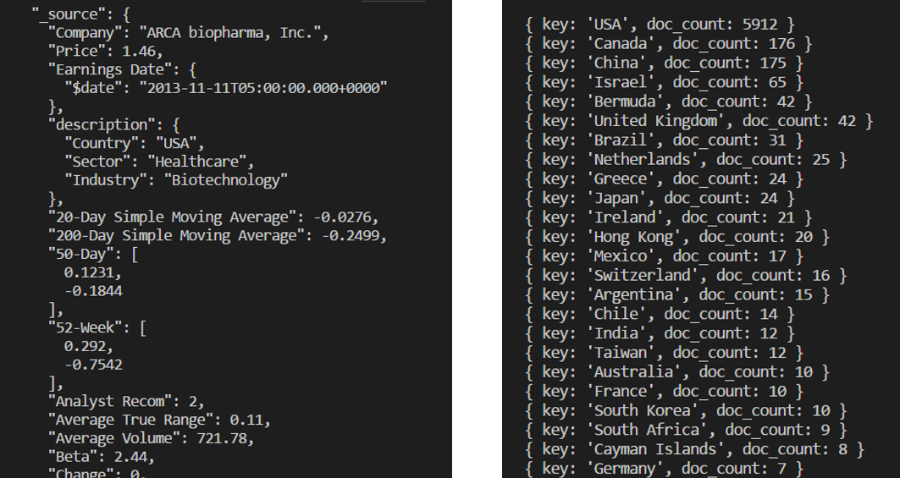
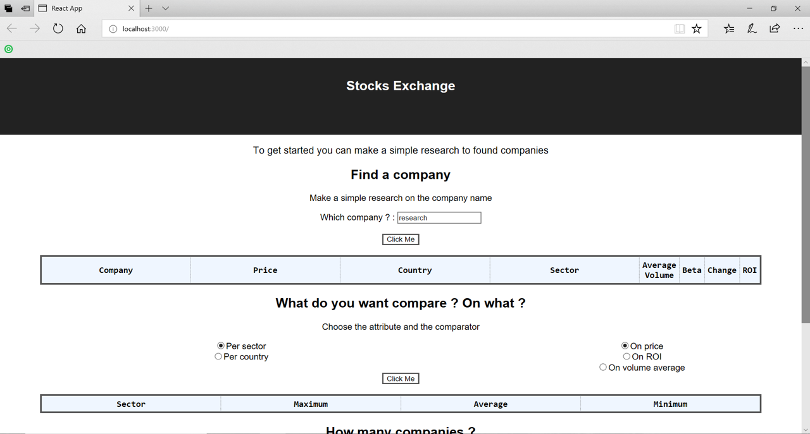

# NoSQL _ Stocks Exchanges

> Application on the NoSQL database we prefer

<!-- START doctoc generated TOC please keep comment here to allow auto update -->
<!-- DON'T EDIT THIS SECTION, INSTEAD RE-RUN doctoc TO UPDATE -->
**Table of Contents**  *generated with [DocToc](https://github.com/thlorenz/doctoc)*

- [Introduction](#introduction)
- [Installation](#installation)
- [Usage](#usage)
  - [API](#api)
  - [REACT](#react)

<!-- END doctoc generated TOC please keep comment here to allow auto update -->

## Introduction

We are going to work the database, StockExchange. 

Inside this project, there is 2 directory : 
* [backend-api](./backend-api) : to make request on elasticSearch 
* [frontend-react](./frontend-react) : to make a web app with react

## Installation 

* Lauch the server of ElasticSearch on port 9200
* Go to yours repositories
* Install the dependencies 
* Run the projects

__Firstly__ in the backend repository : 
``` sh
> cd /path/NoSql_StocksExchange/backend-api
> npm install
> npm start
```
It opens the api on port 9696 and adding connection to http://localhost:9200/ (ElasticSearch)


__Then__ in the frontend repository: 

``` sh
> cd /path/NoSql_StocksExchange/frontend-react
> npm install
> npm start
```
It starts the development server. You can now view the project react in the browser on port 3000. 

## Usage

### API

All records from StocksExchange are already index to ElasticSearch. 

You have __3 Endpoints__ to request the API. There return a JSON list : 
* __/company?mot=x__ : get all companies from the dataset where the name of company match with the parameter 'mot'. 
* __/comparaison?per=x&on=y__ : get a comparison per a first parameter (sector or country) on a second parameter (price, ROI...). It returns the average, the minimum and the maximum of this second parameter.  
* __/count?per=x__ : get the sum of companies per the parameter (sector or country)

<p align=center>
    
    <figcaption>In the right the result of /company?mot=Inc and in the left thr result og /count?per=Country</figcaption>
</p>


### REACT

This is the browser : 

<p align=center>
    
</p>

You can : 
- Find a company with a search bar
- Compare per sector or country on price, roi or volume average
- Count how many companies there are per sector or per country. 

All results are shown in table.

<br />
<br />

Powered by Aurelie Jolas